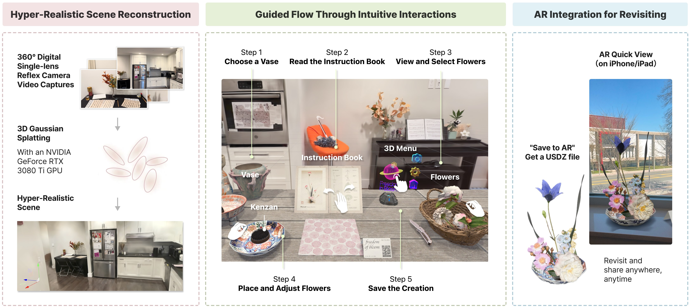

<div align="center">
  <h3>
  Younique: An Extended Reality System for Immersive Cultural Art
Exploration
    
 </h3>
 
</div>
Cultural art practices often face barriers to engagement due to geographical, financial, and educational constraints. Younique, an Extended Reality (XR) system designed to offer an immersive experience for exploring Ikebana, the traditional Japanese art of flower arrangement. The system prioritizes user experience by offering an intuitive, self-guided, and seamlesscultural exploration journey.

<div align="center">
  
</div>


## Some cool videos you should watch
- [**Interactive 360° Demo Video**](https://youtu.be/L8BfW5rFEus) Remember to scroll with mouse!!
- [**Complete User Journey**](https://youtu.be/qeS3Ta6gn8Y?feature=shared)
- [**Tech for the creator**](https://youtu.be/URJMFD1WJQE?feature=shared)

**And follow us on instagram to learn more about ur Younique Journey:**
<div align="center">
  
</div>


## About The Project
Cultural art practices offer opportunities for enrichment, creativity, and preservation but often face accessibility barriers due to geography, cost, and resource limitations [3]. Traditional learning media, such as books and videos, struggle to convey the nuances of hands-on practices, leading to limited engagement. Innovative approaches are needed to democratize access while preserving authenticity and depth.

XR (Extended Reality)—encompassing Virtual, Augmented, and Mixed Reality—offers a promising avenue for enhancing cultural learning through hands-on, immersive experiences. However, XR systems face several challenges. Users often find virtual environments disconnected from their everyday lives, hindering initial engagement. Additionally, digital UI elements or controller-based interactions can disrupt immersion, while the lack of revisitation mechanisms reduces long-term impact and cultural reach.

This study examines how XR systems can enhance cultural engagement through the art of Ikebana. With its Zen-inspired philosophy, intricate gestures, and emphasis on 3D spatial composition, Ikebana serves as an ideal testbed to showcase XR’s potential for intuitive, immersive interactions that deepen cultural understanding.

We present Younique, a hyper-realistic XR system designed to deliver an immersive Ikebana creation experience, contributing to Human-Computer Interaction (HCI) and cultural engagement in the following ways:

**Streamlined Environment Reconstruction Workflow**: We present a hybrid GS-to-VR pipeline that creates ultra-detailed, interactive home workshop settings, grounding virtual experiences in reality to make cultural art practices more relatable and immersive.

**Guided Flow Through Intuitive Interactions**: We developed intuitive, controller-free interactions that closely mimic real-world Ikebana techniques. These interactions are complemented by environment-integrated interfaces designed to minimize distractions while providing sufficient guidance for users to confidently engage in the creative process.

**AR Integration for Revisiting**: We introduce an innovative AR Quick View feature that allows users to save and revisit digital creations, bridging XR experiences with everyday devices and enabling users to share their work widely.

Younique highlights a versatile pipeline for XR applications, combining environment reconstruction, intuitive interactions, and AR revisitation. While focused on Ikebana, the system’s approach has broad potential for cultural art practices, skill-based learning, and immersive education, paving the way for engaging XR experiences across diverse domains.


## Update
We're currently developing our MVP, an immersive virtual experience centered around the art of ikebana. We believe that this XR project offers complex interactions that traditional media can't easily replicate. To bring this vision to life, we've digitized a physical space using 3D scanning technology, turning it into a virtual environment where users can interact with 3D scanned flowers. Participants use a VR headset to arrange these flowers, crafting their own ikebana creations. Afterwards, they can explore and interact with their floral designs in augmented reality, making the experience even more engaging.


<!-- CONTRIBUTORS -->

## Contributors 

**Mackenzie Li**, XR Developer, Harvard 25'

**Grace Mai**, Technical Artist, Harvard 25'

**Vera Wu**, Creative Prototyper, Harvard 25'


<!-- TABLE OF CONTENTS -->

<p><details>
  <summary><h3>Table of Contents</h3></summary>
  <ol>
    <li><a href="#build-with ">Build With</a></li>
    <li><a href="#Documentations ">Documentations</a>
      <ul>
        <li><a href="#folder-structure">Folder Structure</a></li>
        <li><a href="#key-features">Key Features</a></li>
        <li><a href="#Scripts">Scripts</a></li>
      </ul>
    </li>
    <li>
      <a href="#getting-started">Getting Started</a>
      <ul>
        <li><a href="#prerequisites">Prerequisites</a></li>
        <li><a href="#installation">Installation</a></li>
      </ul>
    </li>
    <li><a href="#contributing">Contributing</a></li>
    <li><a href="#credits">Credits</a></li>
    
    <li><a href="#license">License</a></li>
    <li><a href="#acknowledgments">Acknowledgments</a></li>
  </ol>
</details></p>


## Build with

### **Unity 2022.3.21f1** | **StandardRP** | **GraphicAPI-DX12**

OpenXR + XR Interaction Toolkit 3.0.1

Tested on Quest2 and Quest Pro

<p align="right">(<a href="#readme-top">back to top</a>)</p>


## Documentations

Updated on Apr14/2024

### Folder Structure

* Current active Scene: Assets/Scenes/IkebanaWIP

* All Scripts can be fond in Assets/Scripts

* All prefabs in the scene are located in Assets/Flowers

* Gaussian Splat assets can be created from Tools/Gaussian Splat/Create GaussianSplatAsset


### Key Features

**Gaussian Splat Assets:**

* Convert Gaussian splat to the renderable assets -- using [GaussianSplattingVRViewerUnity](https://github.com/clarte53/GaussianSplattingVRViewerUnity) by CLARTE-LAB

**Plates:**

- Plates featuring kanzan can be picked up.
- Once pick up a plate for the first time, player will see a description of kanzan.

**Knife:**

- Player can pick up the knife.
- Use the knife to trim the branches and leaves of flowers.

**Flowers and Leaves:**

- These can also be picked up.
- Player can use the knife to cut them.
- The main branch can be snapped to the kanzan.

**Book/Manual:**

- Player can flip through the book in both directions, depending on which side is touched.

**Menu:**

* clickable hologram
* Save the selected ikebana to FBX when camera button is clicked


### **Scripts**

**Snapping**: snap to pos, preserving the rotation and toggle physics when snap/unsnapped

- AutoSnap.cs:  Attach to snap destination
- SnapObj.cs: Attach to the snaped object

**Hand Interactions**: interactions using hands (other than grab)

- FlipBook.cs: Control flip book forward and backward animation 
- HandMenuInteracter.cs: Control menu buttons
- MenuController.cs: Control menu item transform

**Object Manipulation:**

- Cutcutcut.cs: Unparent the gameobject that is nearest to the cut point.

**Tooltip**: 

- StayVertical.cs: Make info panel stay vertical and facing the camera
- TwoPoiintLine.cs: Render line between two point (run in editor)

**Save FBX file:**

* CustomFbxExporter.cs: Save the selected gameobject to FBX to the desired location (modified from Fbx Exporter for Unity)

**Overwrite XRI**:

* CheckOnGrab.cs: Enable tooltip on the first grab

* CustomSocketInteractor.cs: Flag the gameobject being snapped by socket interaction
* SetDynamicAttachPos.cs: Set dynamic attach pos when XRGrabIneractable is attached to the gameobject in runtime
* XRInstantiateGrabbableObject.cs:  Instantiate XRGrabInteractable to gameobject

**Audio**:

- PlayAudio.cs: Play audio on collision


<p align="right">(<a href="#readme-top">back to top</a>)</p>


<!-- GETTING STARTED -->

## Getting Started

### Prerequisites

* Unity 2022.3.21f1

### Installation

1. Clone the repo
   ```sh
   git clone https://github.com/lmxy0212/VRGaussianSplat.git
   ```

2. Open with Unity Hub
   ```sh
   project path: /VRGaussianSplat/VRGaussianSplat-Younique
   ```

<p align="right">(<a href="#readme-top">back to top</a>)</p>

## Credits

Assets and external resources used in this projects:

- [GaussianSplattingVRViewerUnity](https://github.com/clarte53/GaussianSplattingVRViewerUnity) by CLARTE-LAB
- Alembic
- Fbx Exporter for Unity
- Autodesk FBX SDK for Unity
- [HologramShader](https://github.com/andydbc/HologramShader) by andydbc
- [@ffish.asia / floraZia.com](https://sketchfab.com/ffishAsia-and-floraZia), [@Alexandre Tokovinine](https://sketchfab.com/tokovinin3d), [@Shedmon](https://sketchfab.com/shedmon) [@julesotway](https://sketchfab.com/julesotway) [@s0muchm0tta](https://sketchfab.com/s0muchm0tta) [@Virtual Museums of Małopolska
](https://sketchfab.com/WirtualneMuzeaMalopolski) [@skdmuseum](https://sketchfab.com/skdmuseum) [@Florida Public Archaeology Network](https://sketchfab.com/fpan) [@Arkify 3D](https://sketchfab.com/arkify) from Sketchfab
- 小原流いけばなの基本 by 小原流研究院編
- [@小原流厦门支部-花间清幽](http://xhslink.com/N449fH)


<!-- LICENSE -->

## License

Distributed under the MIT License. See `LICENSE.txt` for more information.

<p align="right">(<a href="#readme-top">back to top</a>)</p>
