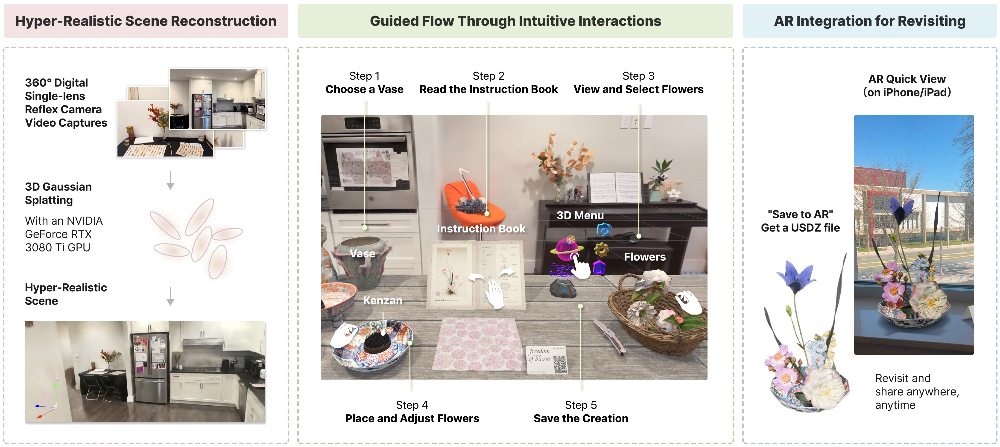

  <h3>
  Younique: An Extended Reality System for Immersive Cultural Art
Exploration
    
 </h3>

  
### Project Summary 
Younique is a 3D experience-sharing hub that reimagines how we record, share, and revisit experiences. Just as written stories, photographs, and short videos have shaped past generations of sharing, we believe the next evolution lies in spatial, immersive formats. Younique explores how XR technologies can transform passive viewers into active participants.
Our pilot module centers on Ikebana, the traditional Japanese art of flower arrangement. Using a custom pipeline that combines 3D Gaussian Splatting for environment reconstruction, Unity for interaction design, and OpenXR hand-tracking, we create a hyper-realistic, controller-free VR experience. Users can intuitively compose their own floral arrangements and save them as shareable AR assets—portable, embeddable, and revisitable on any compatible mobile device.
Younique is both a design exploration and a technical prototype. It asks: What does it mean to “share an experience” in 3D? How do we preserve the texture of human interaction through spatial interfaces? And how can immersive media help us engage with unfamiliar experiences more personally?
By making embodied, sensory experiences accessible and interactive, Younique opens up new directions in cultural learning, storytelling, and digital memory-making.

### Project Videos
- [**Interactive 360° Demo Video**](https://youtu.be/L8BfW5rFEus) Remember to scroll with mouse!!
- [**Complete User Journey**](https://youtu.be/qeS3Ta6gn8Y?feature=shared)
- [**Tech for the creator**](https://youtu.be/URJMFD1WJQE?feature=shared)

  

### Contributors 

**Mackenzie Li**, XR Developer, Harvard 25'

**Grace Mai**, Technical Artist, Harvard 25'

**Vera Wu**, Creative Prototyper, Harvard 25'

### And follow us on instagram to learn more about ur Younique Journey:

  

## About The Project
Cultural art practices offer opportunities for enrichment, creativity, and preservation but often face accessibility barriers due to geography, cost, and resource limitations [3]. Traditional learning media, such as books and videos, struggle to convey the nuances of hands-on practices, leading to limited engagement. Innovative approaches are needed to democratize access while preserving authenticity and depth.

XR (Extended Reality)—encompassing Virtual, Augmented, and Mixed Reality—offers a promising avenue for enhancing cultural learning through hands-on, immersive experiences. However, XR systems face several challenges. Users often find virtual environments disconnected from their everyday lives, hindering initial engagement. Additionally, digital UI elements or controller-based interactions can disrupt immersion, while the lack of revisitation mechanisms reduces long-term impact and cultural reach.

This study examines how XR systems can enhance cultural engagement through the art of Ikebana. With its Zen-inspired philosophy, intricate gestures, and emphasis on 3D spatial composition, Ikebana serves as an ideal testbed to showcase XR’s potential for intuitive, immersive interactions that deepen cultural understanding.

We present Younique, a hyper-realistic XR system designed to deliver an immersive Ikebana creation experience, contributing to Human-Computer Interaction (HCI) and cultural engagement in the following ways:

**Streamlined Environment Reconstruction Workflow**: We present a hybrid GS-to-VR pipeline that creates ultra-detailed, interactive home workshop settings, grounding virtual experiences in reality to make cultural art practices more relatable and immersive.

**Guided Flow Through Intuitive Interactions**: We developed intuitive, controller-free interactions that closely mimic real-world Ikebana techniques. These interactions are complemented by environment-integrated interfaces designed to minimize distractions while providing sufficient guidance for users to confidently engage in the creative process.

**AR Integration for Revisiting**: We introduce an innovative AR Quick View feature that allows users to save and revisit digital creations, bridging XR experiences with everyday devices and enabling users to share their work widely.

Younique highlights a versatile pipeline for XR applications, combining environment reconstruction, intuitive interactions, and AR revisitation. While focused on Ikebana, the system’s approach has broad potential for cultural art practices, skill-based learning, and immersive education, paving the way for engaging XR experiences across diverse domains.

## Build with

### **Unity 2022.3.21f1** | **StandardRP** | **GraphicAPI-DX12**

OpenXR + XR Interaction Toolkit 3.0.1

Tested on Quest2 and Quest Pro

## Credits

Assets and external resources used in this projects:

- [GaussianSplattingVRViewerUnity](https://github.com/clarte53/GaussianSplattingVRViewerUnity) by CLARTE-LAB
- Alembic
- Fbx Exporter for Unity
- Autodesk FBX SDK for Unity
- [HologramShader](https://github.com/andydbc/HologramShader) by andydbc
- [@ffish.asia / floraZia.com](https://sketchfab.com/ffishAsia-and-floraZia), [@Alexandre Tokovinine](https://sketchfab.com/tokovinin3d), [@Shedmon](https://sketchfab.com/shedmon) [@julesotway](https://sketchfab.com/julesotway) [@s0muchm0tta](https://sketchfab.com/s0muchm0tta) [@Virtual Museums of Małopolska
](https://sketchfab.com/WirtualneMuzeaMalopolski) [@skdmuseum](https://sketchfab.com/skdmuseum) [@Florida Public Archaeology Network](https://sketchfab.com/fpan) [@Arkify 3D](https://sketchfab.com/arkify) from Sketchfab
- 小原流いけばなの基本 by 小原流研究院編
- [@小原流厦门支部-花间清幽](http://xhslink.com/N449fH)

## License

Distributed under the MIT License. See `LICENSE.txt` for more information.
